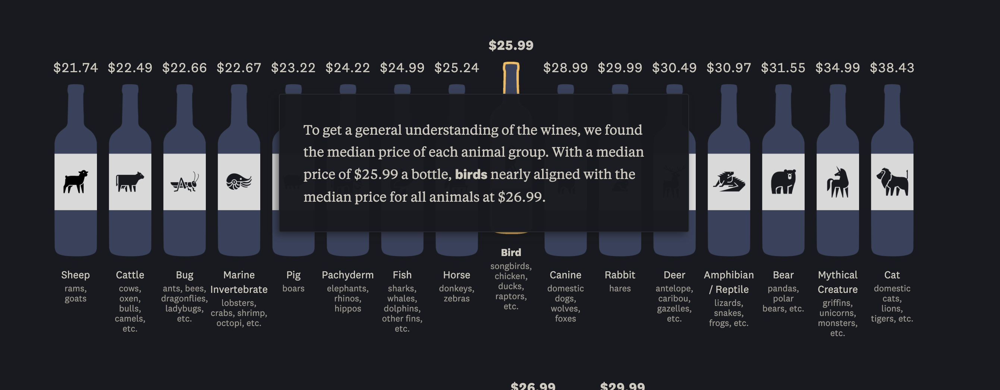
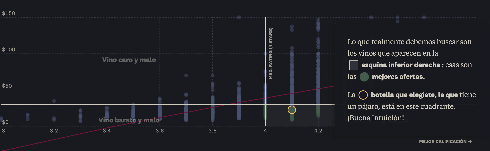

# Análisis de Webstory Wine animals

**Nombre:** Wine animals

**Por Clarita Díaz - The Pudding** https://pudding.cool/2025/04/wine-animals/  

**Descripción de la historia**

La webstory Wine Animals analiza la relación entre los animales presentes en las etiquetas de botellas de vino y su precio y calidad. A partir de datos recolectados desde la aplicación Vivino, se construye una base de datos de más de 1.400 vinos con etiquetas de animales.
 
La historia parte de un caso hipotetico: "Tienes prisa y necesitas comprar una botella de vino para una ocasión especial. Tienes 40 dólares y no te importa si es tinto o blanco, pero te gustan los vinos con etiquetas de animales. ¿Qué vino vas a comprar?". 
Aquí la situación hipotetica hace responder una pregunta aparentemente irrelevante pero termina siendo bastante interesante: ¿puede el animal en la etiqueta ayudarte a elegir un buen vino? A partir de esta pregunta, se exploran patrones entre tipo de animal, precio y puntuación, revelando tendencias inesperadas sobre valor y percepción.
 
A lo largo de la página se desarrolla un análisis más profundo sobre cómo operan las decisiones de consumo. La historia de la página web utiliza esta premisa para explorar la relación entre elementos visuales de las etiquetas de los vinos, como los animales y variables como el precio y la puntuación de los vinos.

A medida que avanza, el relato va revelando patrones que cruzan categorías de animales, rangos de precios y valoraciones de usuarios.  De a poco se empieza a cuestionar sobre la percepción que tienen los consumidores del valor, el diseño de productos y los sesgos que influyen en la elección de compra del vino. En ese sentido, la webstory no solo informa, sino que también muestra que elementos aparentemente decorativos o de estética pueden influir en la manera en que evaluamos y elegimos un producto.

 

**Aspectos  interesante de su estructura narrativa**

La webstory de The Pudding destaca por su estructura narrativa progresiva e interactiva. Uno de los elementos más interesantes es la personalización, ya que desde el inicio se integra al usuario en la historia al destacar el animal del vino que eligió, generando mayor involucramiento y a mi parecer más entretenida la dinámica de la página web.
Además, hay una explicación guiada de las imágenes/gráficos. Como se observa en las imágenes, primero presenta la clasificación de animales en categorías comprensibles, luego introduce el gráfico de dispersión explicando sus ejes (precio y calificación), y finalmente interpreta los resultados a través de cuadrantes como “vino bueno y barato”. Esta progresión facilita la comprensión incluso sin conocimientos del vino.
Otro aspecto clave es la traducción de datos complejos a conceptos cotidianos, lo que permite una lectura mucho más intuitiva. Finalmente, la retroalimentación directa al usuario, de  “tu vino está aquí” refuerza la experiencia interactiva y narrativa.

Visualización de categorías de animales

**Evaluación de la efectividad para transmitir información**

La webstory es muy efectiva para transmitir información, ya que logra equilibrar datos, diseño y narrativa. La información se presenta de forma gradual, lo que reduce la sobrecarga y facilita la comprensión. Las visualizaciones son claras y bien explicadas, permitiendo identificar patrones rápidamente. Además, el uso de interacción mantiene la atención del usuario y lo convierte en parte activa del análisis.  Cumple exitosamente su objetivo: hacer accesible y atractiva una base de datos compleja, demostrando el potencial del periodismo de datos para comunicar de forma efectiva.
